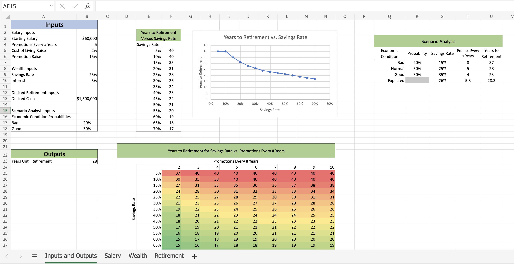

# Financial modelling in Python and Excel

##### Projects:

**Retirement Model**

- [Static Retirement Model](#static-retirement-model)
- [Sensitivity Analysis Retirement Model](#sensitivity-analysis-retirement-model)

**Time Value of Money (TVM)**

- [Machines Manufacturing Captal Budgeting Model](#machines-manufacturing-captal-budgeting-model)

## Static Retirement Model

[Python code](https://github.com/369geofreeman/Financial_Models/blob/main/code/Retirement_model_with_iteration/dynamic_retirement_model.ipynb) | [Excel Workbook](https://github.com/369geofreeman/Financial_Models/blob/main/Excel/retirement%20with%20iteration.xlsx)

**A retirement model which models salary with both a constant growth rate for cost of living raises as well as regular salary increases for promotions. The model is broken up into the following sections:**

- **Setup**: (In python notbook): Runs any imports and other setup
- **Inputs**: Defines the inputs for the model
- **Salaries**: Determining the salary in each year, considering cost of living raises and promotions
- **Wealths**: Determining the wealth in each year, considering a constant savings rate and investment rate
- **Retirement**: Determines years to retirement from the wealths over time, the main output from the model.

---

## Sensitivity Analysis Retirement Model

[Python code]() | [Excel Workbook](https://github.com/369geofreeman/Financial_Models/blob/main/Excel/Dynamic%20Salary%20Retirement_Model_External_Scenarios.xlsx)

For a detailed worked view of Sensitivity Analysis in a Jupyter notebook [Click Here](https://github.com/369geofreeman/Financial_Models/blob/main/code/Retirement_model_with_sesitivity_analysis/sensitivity_analysis.ipynb)

Sensitivity analysis is the process of passing different inputs to a model to see how the outputs change. it differs from Monte Carlo Simulation in that no probability distributions are assigned to the inputs, and typically larger ranges of the inputs are chosen. the purpose of Sensitivity Analysis is to understand how the outputs change over the full range of possible inputs. Sentitivity Analysis does not derive any expected outcome or a probability distribution of outcomes, instead returning a range of possible output variables associated with each set of inputs.

- Applying sensitivity analysis to the retirement model allows us to understand how the full range of possible inputs affects the results of the model.
- We are running the model multiple times with different inputs and showing the outputs.
- Importantly we will focus more on visualisation, as now there are many different outputs it is easier to draw meaning from them when visualised.

**Formal definition**

- **y**: model output
- **X**: model input matrix
- **xi**: Value of **ith x** variable

**For the folowwing steps**

- Choose a set of values for each **xi**
- Take the cartesian product of these values as **[X1, X2, ..., Xn]**
- For each **Xi** calculate **yi = f(Xi)**
- Store the values of **Xi** mapped to **yi**
- Visualise **yi** versus **Xi**

# Time Value of Money

## Static TVM Model

The time value of money (TVM) is the concept that a sum of money is worth more now than the same sum will be at a future date due to its earnings potential in the interim.

**Overview**

In this project we are building a financial model for a startup that is trying to maufacture phones.

We are tasked with building a model which will help determine how many machines to invest in and how much to spend on marketing. Each machine produces
n_output phones per year. Each phone sells for $p_phone and costs $c_phone in variable costs to produce.

After n_life years, the machine can no longer produce output, but may be scrapped for $p_scrap. The machine will not be replaced, so we may end up with zero total output before our model time period ends.

Equity investment is limited, so in each year we can spend c_machine to either buy a machine or buy advertisements. In the first year we must buy a machine. Any other machine purchases must be made one after another (advertising can only begin after machine buying is done). Demand for our phones starts at d_1. Each time we advertise, demand increases by g_d%. The prevailing market interest rate is r.

**Model Inputs**

- **n_output**: Number of phones per machine per year
- **n_machines**: Number of machines purchased
- **n_life**: Number of years for which the machine produces phones
- **p_phone**: Price per phone
- **p_scrap**: Scrap value of machine
- **c_machine**: Price per machine or advertising year
- **c_phone**: Variable cost per phone
- **d_1**: Quantity of phones demanded in the first year
- **g_d**: Percentage growth in demand for each advertisement
- **r**: Interest rate earned on investments

**Model Outputs**

- Cash flows in each year, up to 20 years
- PV of cash flows, years 1 - 20

# Machines Manufacturing Captal Budgeting Model

**[jupyter notebook](https://github.com/369geofreeman/Financial_Models/blob/main/code/tvm/tvm.ipynb)**

### Overview

**The Problem**

You work for a new startup that is trying to manufacture phones. You are tasked with building a model which will help determine how many machines to invest in and how much to spend on marketing. Each machine produces $n_{output}$ phones per year. Each phone sells for $P_{phone}$ and costs $c_{phone}$ in variable costs to produce. After years, the machine can no longer produce output, but may be scrapped for $p_{scrap}$. The machine will not be replaced, so you may end up with zero total output before your model time period ends.

Equity investment is limited, so in each year you can spend $c_{machine}$ to either buy a machine or buy advertisements. In the first year you must buy a machine. Any other machine purchases must be made one after another (advertising can only begin after machine buying is done). Demand for your phones starts at $d_1$. Each time you advertise, demand increases by $g_d$%. The prevailing market interest rate is $r$.

**Notes**

- Model is limited to 20 years and a maximum of 5 machines.
- For simplicity, assume that is paid in every year, even after all machines have shut down.
- Ensure that you can change the inputs and the outputs change as expected.
- For simplicity, assume that fractional phones can be sold, you do not need to round the quantity transacted.
