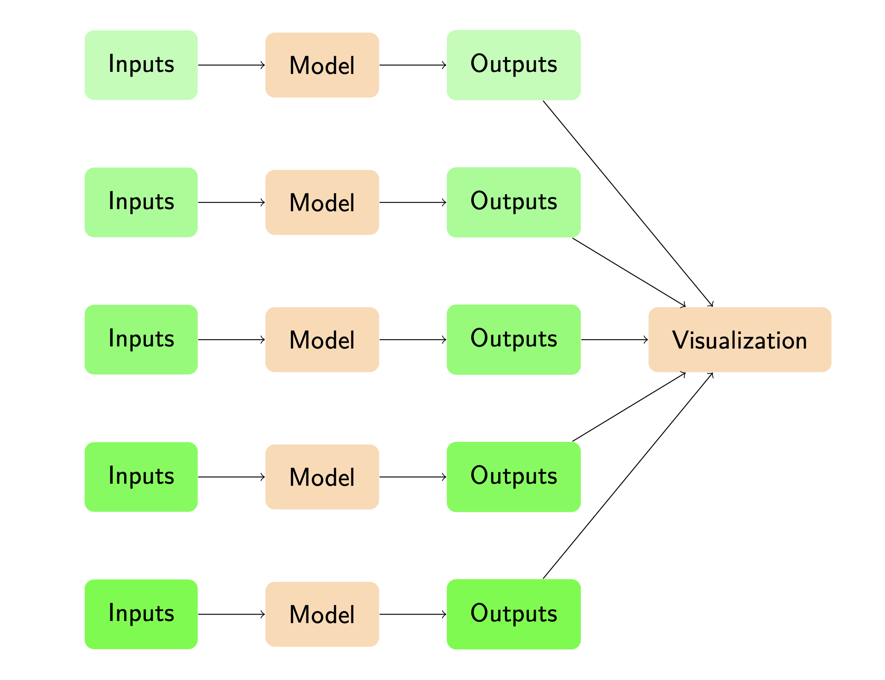
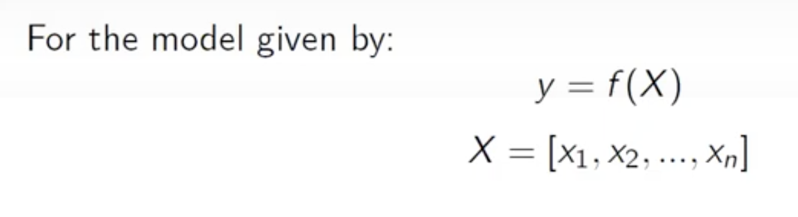

# Financial modelling in Python and Excel

**All projects have been created in both python and excel workbooks**

##### Projects:

- [Retirement Model (Static model)](#Static_Retirement_Model)
- [Retirement Model (Sensitivity Analysis)](#Sensitivity_Analysis_Retirement_Model)

## Static Retirement Model

[Python code](https://github.com/369geofreeman/Financial_Models/blob/main/code/Retirement_model_with_iteration/dynamic_retirement_model.ipynb) | [Excel Workbook](https://github.com/369geofreeman/Financial_Models/blob/main/Excel/retirement%20with%20iteration.xlsx)

**A retirement model which models salary with both a constant growth rate for cost of living raises as well as regular salary increases for promotions. The model is broken up into the following sections:**

- **Setup**: (In python notbook): Runs any imports and other setup
- **Inputs**: Defines the inputs for the model
- **Salaries**: Determining the salary in each year, considering cost of living raises and promotions
- **Wealths**: Determining the wealth in each year, considering a constant savings rate and investment rate
- **Retirement**: Determines years to retirement from the wealths over time, the main output from the model.

---

## Sensitivity Analysis Retirement Model

[Python code]() | [Excel Workbook]()

- Applying sensitivity analysis to the retirement model allows us to understand how the full range of possible inputs affects the results of the model.
- We are running the model multiple times with different inputs and showing the outputs.
- Importantly we will focus more on visualisation, as now there are many different outputs it is easier to draw meaning from them when visualised.

**Formal definition**

- **y**: model output
- **X**: model input matrix
- **xi**: Value of **ith x** variable

**for the folowwing steps**

- Choose a set of values for each **xi**
- Take the cartesian product of these values as **[X1, X2, ..., Xn]**
- For each **Xi** calculate **yi = f(Xi)**
- Store the values of **Xi** mapped to **yi**
- Visualise **yi** versus **Xi**
