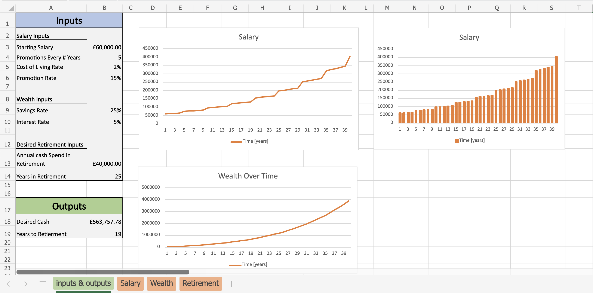
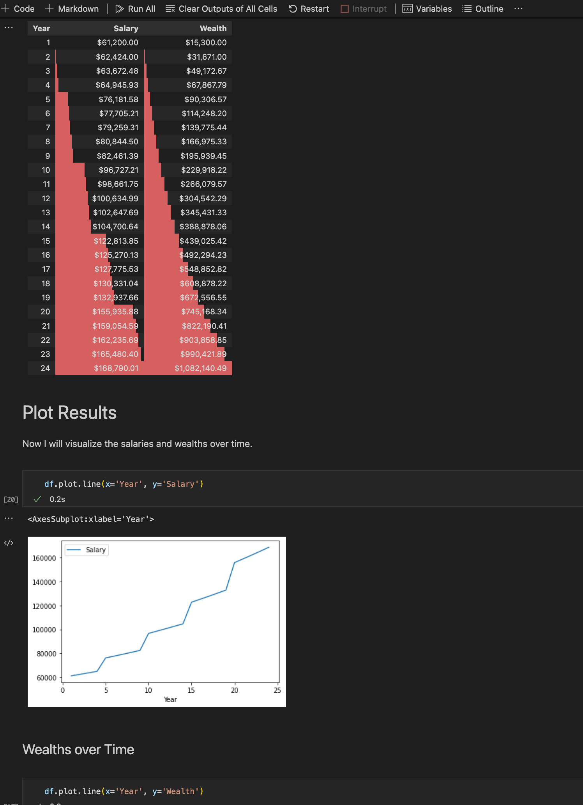

# Financial modelling in Python and Excel

**All projects have been created in both python and excel workbooks**

##### Projects:

- [Retirement Model](#Retirement_model)

## Retirement model

[Python code](https://github.com/369geofreeman/Financial_Models/blob/main/code/Retirement_model_with_iteration/dynamic_retirement_model.ipynb) | [Excel Workbook](https://github.com/369geofreeman/Financial_Models/blob/main/Excel/retirement%20with%20iteration.xlsx)

**A retirement model which models salary with both a constant growth rate for cost of living raises as well as regular salary increases for promotions. The model is broken up into the following sections:**

- **Setup**: (In python notbook): Runs any imports and other setup
- **Inputs**: Defines the inputs for the model
- **Salaries**: Determining the salary in each year, considering cost of living raises and promotions
- **Wealths**: Determining the wealth in each year, considering a constant savings rate and investment rate
- **Retirement**: Determines years to retirement from the wealths over time, the main output from the model.

---
